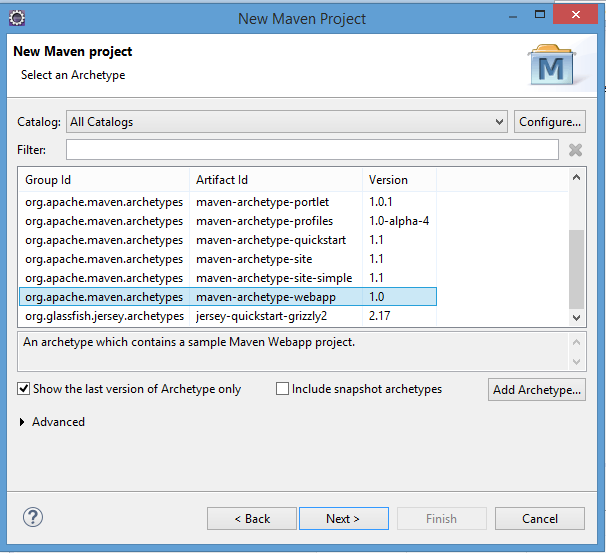

# Getting Started
The following series of tutorials shall give a starting point how to use the JPA-Processor to get a quick start in a Java project to utilize [Olingo](https://olingo.apache.org/doc/odata4/index.html) when [OData](http://www.odata.org/) shall be used. The tutorials use a simplified Business Partner data model.

## Prerequisites
In order to follow this tutorial, you should have
* Basic knowledge about OData and OData V4
* Knowledge of the Java programming language
* Basic knowledge about building with Maven
* Optional: knowledge about developing web applications

## Preparation
In order to perform the tutorial you need:
* A Java JDK 1.8 or higher
* An IDE for Java<sup>TM</sup> EE, e.g. IntelliJ IDEA Ultimate, or Eclipse IDE for Enterprise Java, or another IDE providing the functionality for Jakarta EE, formerly Java<sup>TM</sup> EE.
* An installed servlet container e.g. Apache Tomcat, installed as server runtime in the IDE.
* Access to the pre-build odata-jpa-processor package.

## Create Project
First step is to create a project. To do so, we want to create a new Maven project, by open the Maven Project wizard via File -> New -> Other -> Maven -> Maven Project. Select archetype **webapp**:



On the next page, enter the following information:
* GroupId Id: my.group.id
* Artifact Id: DemoJPAService
* Version: 0.0-SNAPSHOT
* Package: myservice.mynamespace.service

Convert the project into a JPA project. This can be done as follows:

_Right click on the new project --> Configure --> Convert to JPA Project ..._

Now the project facets maintenance screen pops up. make sure that:
* Dynamic Web Module has at least version 2.5
* Java version is to be 1.8 or higher
* JPA as version 2.2


You can delete the index.jsp if it creates an error, we will not use it. Next step is to create the maven dependencies. For this tutorial we will use [HSQLDB](http://hsqldb.org/) as in-memory database and [Eclipselink](http://www.eclipse.org/eclipselink/)-based persistence services, but you can use also another database or JPA implementation that supports JPA 2.2. To create the data on the database we use Flyway. The following snippet shows the additionally required maven dependencies:
```XML
<?xml version="1.0" encoding="UTF-8"?>
<project xmlns="http://maven.apache.org/POM/4.0.0"
         xmlns:xsi="http://www.w3.org/2001/XMLSchema-instance"
         xsi:schemaLocation="http://maven.apache.org/POM/4.0.0 http://maven.apache.org/xsd/maven-4.0.0.xsd">
    <modelVersion>4.0.0</modelVersion>

    <groupId>com.example.sapjpa</groupId>
    <artifactId>DemoOdataService</artifactId>
    <version>0.0-SNAPSHOT</version>
    <packaging>war</packaging>

    <name>Demo Odata4 Service by a JPA processor</name>
    <!-- FIXME change it to the project's website -->
    <url>http://www.example.com</url>

    <dependencies>
        <dependency>
            <groupId>nl.buildforce.sequoia</groupId>
            <artifactId>odata4-jpa-processor</artifactId>
            <version>0.3.8</version>
        </dependency>
        <dependency>
            <groupId>javax.servlet</groupId>
            <artifactId>javax.servlet-api</artifactId>
            <version>4.0.1</version>
            <scope>provided</scope>
        </dependency>
        <dependency>
            <groupId>org.eclipse.persistence</groupId>
            <artifactId>eclipselink</artifactId>
            <version>2.7.5</version>
        </dependency>

        <dependency>
            <groupId>org.flywaydb</groupId>
            <artifactId>flyway-core</artifactId>
            <version>6.1.4</version>
        </dependency>
        <dependency>
            <groupId>org.hsqldb</groupId>
            <artifactId>hsqldb</artifactId>
            <version>2.5.0</version>
        </dependency>

        <dependency>
            <groupId>org.junit.jupiter</groupId>
            <artifactId>junit-jupiter-api</artifactId>
            <version>5.6.0</version>
            <scope>test</scope>
        </dependency>
    </dependencies>
    <build>
        <finalName>DemoOdata4Service</finalName>
        <pluginManagement><!-- lock down plugins versions to avoid using Maven defaults (may be moved to parent pom) -->
            <plugins>
                <plugin>
                    <artifactId>maven-compiler-plugin</artifactId>
                    <version>3.8.1</version>
                    <configuration>
                        <compilerArgument>-Xlint:unchecked</compilerArgument>
                        <encoding>UTF-8</encoding>
                        <showDeprecation>true</showDeprecation>
                        <showWarnings>true</showWarnings>
                        <source>${maven.compiler.source}</source>
                        <target>${maven.compiler.target}</target>
                    </configuration>
                </plugin>
            </plugins>
        </pluginManagement>
    </build>
    <properties>
        <project.build.sourceEncoding>UTF-8</project.build.sourceEncoding>
        <maven.compiler.source>1.8</maven.compiler.source>
        <maven.compiler.target>1.8</maven.compiler.target>
    </properties>
</project>
```
Before we start we should have a look at the data model we want to create step-by-step throughout the tutorial. The data model describes, as mentioned, a simple business partner. The business partner has a name (fields NameLine1 and NameLine2), an address, information about who and when a business partner was created or changed, and some fields thata user of the model can give his/her own semantic (CustomString1,CustomString2,CustomNum1,CustomNum2). A business partner can have multiple BusinessPartnerRoles. In addition, there is some information about the region the business partner is located at. This information is stored in table AdministrativeDivision. Last, but not least there are textual description for the regions and countries.


Now we can start with the first series of tutorial about [using Metadata generation](../Metadata/1-0-Overview.md). Later you can learn in a second series of tutorial [how to retrieve data](../RetrieveData/2-0-Overview.md). Last, but not least, we will see how to [manipulate data](../ChangeData/3-0-Overview.md).
In addition, there are documents handling some [special topics](../SpecialTopics/4-0-Overview.md).